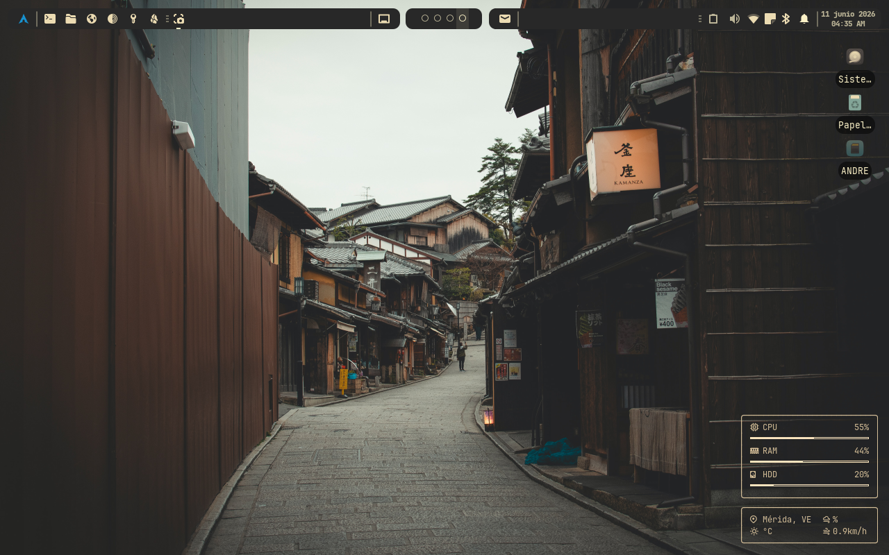
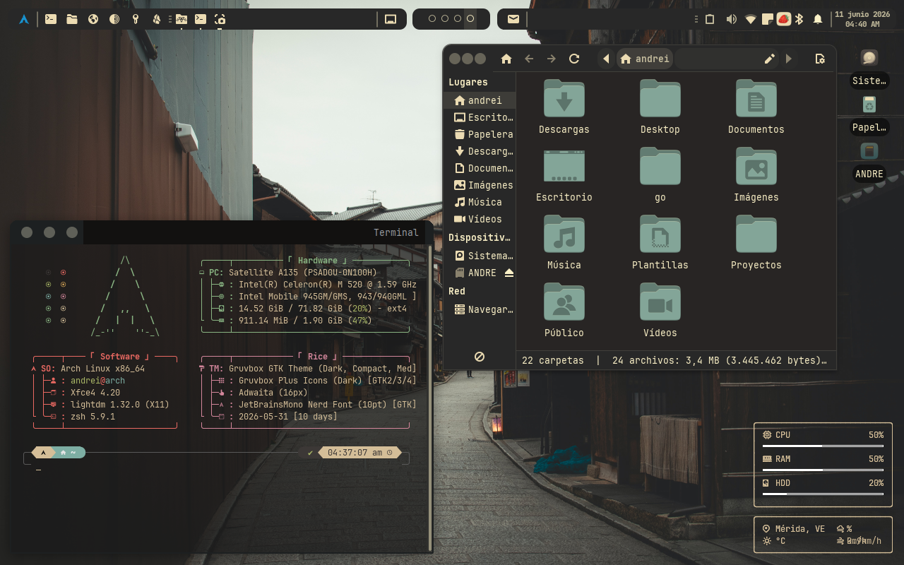
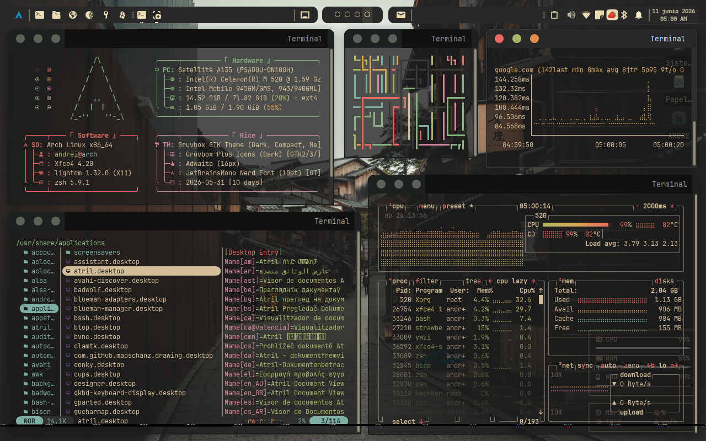
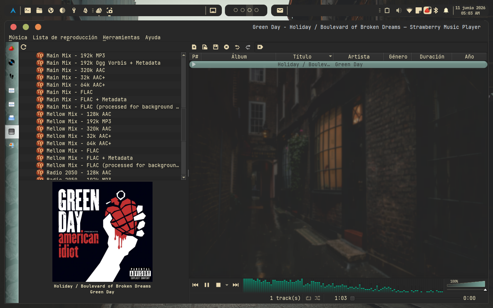

# Arch Linux Gruvbox
**Ecosistema y Tema para Arch Linux con XFCE / LightDM / XFWM4**

Esta configuración personal, tematizada en Gruvbox, contiene una lista preseleccionada de utilidades para convertir una máquina en algo completamente funcional. Los dotfiles contenidos aquí son sobretodo configuraciones esenciales del sistema, de los paquetes y sus esquemas de color. Revise con suma atención lo que necesita.

Todo ésto se hizo pensando en rescatar una laptop Toshiba de cuando los tigres fumaban (de verdad ni siquiera Windows 7 le corría bien). Ahora con buen rendimiento y de paso, una distro con buena fachada para trabajar. Puede considerarlo un manual para replicarlo en la máquina de su gusto.






## Instrucciones
- Para evitar errores, instale primero la lista de paquetes y por último aplique los dotfiles.
- Al instalar un paquete enlistado con una nota anclada, seguir instrucciones inmediatamente de esa misma nota.
- Los dotfiles están en formato MD, contienen señalizaciones y bloques de código según el archivo a modificar.
- Los dotfiles ocultos tienen un ```(.)``` al principio del nombre.
- El valor ```TU_USUARIO``` en este repositorio deberá ser reemplazado por el nombre real del usuario de tu máquina.
- Importe la configuración de panel de **ArchGruvboxPanels.tar.bz2** en la app de Perfiles de Paneles (xfce4-panel-profiels).

## A consideración
Programas nativos a eliminar (si instalaste XFCE con archinstall):
 - [x] xfce4-eyes-plugin
 - [x] xfce4-xkb-plugin
 - [x] xfce4-weather-plugin
 - [x] xfce4-verve-plugin
 - [x] xfce4-time-out-plugin
 - [x] xfce4-timer-plugin
 - [x] xfce4-smartbookmark-plugin
 - [x] xfce4-sensors-plugin
 - [x] xfce4-places-plugin
 - [x] xfce4-mpc-plugin
 - [x] xfce4-mount-plugin
 - [x] parole

 Programas opcionales a eliminar (si no lo usas):
 - [x] xfburn

# [INSTALACIÓN]
## Temas
[^1]

| **[ Temas ]** | **===[ Enlaces ]===** |
|---------------|-----------------------|
| **Toshiba Distro GRUB Theme** | https://k1ng.dev/distro-grub-themes/preview |
| **Gruvbox GTK Theme** | https://github.com/Fausto-Korpsvart/Gruvbox-GTK-Theme |
| **Gruvbox Plus Icon Pack** | https://github.com/SylEleuth/gruvbox-plus-icon-pack |
| **Capitaine Cursors** | https://github.com/sainnhe/capitaine-cursors |

| **[ Apps ]** | **===[ Enlaces ]===** |
|--------------|-----------------------|
| **Yazi** | https://github.com/matt-dong-123/gruvbox-material.yazi |
| **Telegram** | https://github.com/nathanielevan/gruvbox-material-telegram |
| **Mousepad** | https://github.com/xelser/gruvbox-gtksourceview |
| **Terminal** | https://gogh-co.github.io/Gogh/ |
| **Bat** | https://github.com/molchalin/gruvbox-material-bat |

| **[ Otros ]** | **===[ Enlaces ]===** |
|---------------|-----------------------|
| **Wallpapers** | https://github.com/dharmx/walls/blob/main/gruvbox/README.md |

## Terminal
### ---TUI---
- [x] fastfetch
- [x] pacseek
- [x] yazi
    - [x] 7zip
    - [x] jq
    - [x] poppler
    - [x] fd
    - [x] fzf
    - [x] zoxide 
    - [x] resvg
    - [x] imagemagick
    - [x] xclip
    - [x] chafa
    - [x] ueberzugpp
- [x] tmux
- [x] duf
- [x] dust
- [x] btop
- [x] gping
- [x] lsd
- [x] ripgrep
- [x] procs
- [x] bat
- [x] man-db

### ---Herramientas---
- [x] base-devel
- [x] go
- [x] git
    - [x] github-cli
- [x] yay-bin (AUR)
- [x] chaotic-keyring
- [x] chaotic-mirrorlist
- [x] pacman-contrib
- [x] reflector
- [x] gvfs-gphoto2
- [x] gvfs-mtp
- [x] blueman
- [x] bluez-obex
- [x] hunspell-es_ve
- [x] gspell
- [x] aspell
- [x] nuspell
- [x] hspell
- [x] libvoikko
- [x] proxychains-ng
- [x] thc-secure-delete (AUR)
- [x] ffmpegthumbnailer
- [x] unrar
- [x] unzip
- [x] zip

### ---Rice---
- [x] ttf-jetbrains-mono-nerd
- [x] noto-fonts
    - [x] noto-fonts-emoji
- [x] zsh
    - [x] zsh-syntax-highlighting
    - [x] zsh-autosuggestions
    - [x] zsh-completions
- [x] oh-my-zsh-git (AUR) [^2]
- [x] zsh-theme-powerlevel10k (AUR)
- [x] gnome-themes-extra
- [x] gtk-engine-murrine (AUR) --> MANUAL
- [x] gtk2 (AUR) --> MANUAL
- [x] sassc
- [x] plymouth

## Distro
### ---Sistema---
- [x] timeshift
- [x] clamav [^3]
    - [x] clamtk
- [x] conky [^4]
- [x] lightdm-gtk-greeter-settings
- [x] xfce4-docklike-plugin
- [x] xfce4-panel-profiles
- [x] menulibre (AUR)
- [x] mugshot
- [x] gparted
- [x] scrcpy
- [x] qalculate-gtk

### ---Multimedia---
- [x] drawing
- [x] atril
- [x] strawberry
- [x] vlc
    - [x] vlc-gui-skins2
    - [x] vlc-materia-skin-git (AUR)

### ---Productividad---
- [x] libreoffice-fresh
    - [x] libreoffice-fresh-es
- [x] gucharmap
- [x] obsidian
    - [x] Remotely Save (Plugin)
    - [x] Material Gruvbox (Tema)

### ---Internet---
- [x] badwolf
- [x] torbrowser-launcher
- [x] koofr-desktop-bin (AUR)
- [x] qbittorrent
- [x] riseup-vpn (AUR) [^5]
- [x] telegram-desktop
- [x] signal-desktop
- [x] keepassxc

# [NOTAS]
[^1]: Cambiar nombre de carpeta de Gruvbox GTK Theme a: ```Gruvbox (Dark, Compact, Medium, Borderless, MacOS)``` | Cambiar nombre de carpeta de Gruvbox Plus Icon Pack a: ```Gruvbox Plus Icons (Dark)``` | Cambiar nombre de carpeta de Capitaine Cursors a: ```Capitaine Cursors (Gruvbox)```

[^2]: Ejecutar en Terminal: ```sudo ln -s /usr/share/zsh/plugins/zsh-syntax-highlighting /usr/share/oh-my-zsh/custom/plugins/zsh-syntax-highlighting``` | Y después: ```sudo ln -s /usr/share/zsh/plugins/zsh-autosuggestions /usr/share/oh-my-zsh/custom/plugins/zsh-autosuggestions```

[^3]: Ejecutar en Terminal antes de clamtk: ```freshclam```

[^4]: Agregar proceso a Sesión e Inicio; orden: ```conky --daemonize --pause=5```

[^5]: Cambiar orden de lanzador en menú: ```env QT_QUICK_BACKEND=software riseup-vpn %U```
